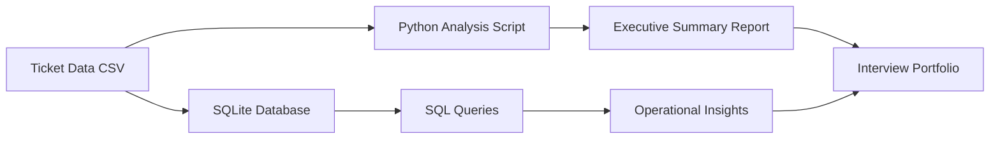

# Architecture

## What this shows

This project connects technical work to business outcomes.

- CSV shows basic data handling.
- SQLite shows database fundamentals.
- SQL queries show structured analysis.
- Python script shows automation.
- Markdown report shows business communication.
- GitHub Actions shows basic CI/CD awareness.
